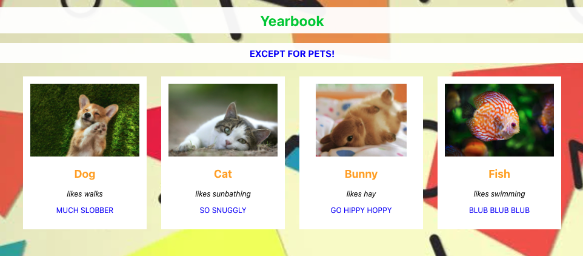

# Yearbook

This application shows images of animals with information underneath them. It's a mini-project made in a few hours to learn React.

## Motivation and rubric

This project was completed as a project at Turing School of Software & Design during Module 3.

[The rubric is linked here.](https://frontend.turing.edu/projects/module-3/turing-yearbook.html)

The goals are developing some muscle memory in building out simple React components and passing data down as props.

## Reflections

It was fun to learn React. This is going to be quite useful.

## Languages and technology

Written in JavaScript, CSS, & JSX

Utilizes NPM, & React

Built with Visual Studio Code

[Code stored on GitHub](https://github.com/hayleyw7/yearbook-2)

## Repository install and setup

### Clone project repository

Enter the following command in the Terminal:
`git clone https://github.com/hayleyw7/yearbook-2.git`

### Navigate to folder

Enter the following command in the Terminal:
`cd yearbook-2`

### Install dependencies

Enter the following command in the Terminal:
`npm install`

## Access and use website

Enter the following command in the Terminal:
`npm start`

The page will open in your browser. You will then be able to view all cards.

## Screenshot

  -->

## Contributors

Project completed by [Hayley Witherell](https://github.com/hayleyw7)

Project designed by [Travis Rollins](https://github.com/Kalikoze) & [Leta Keane](https://github.com/letakeane)